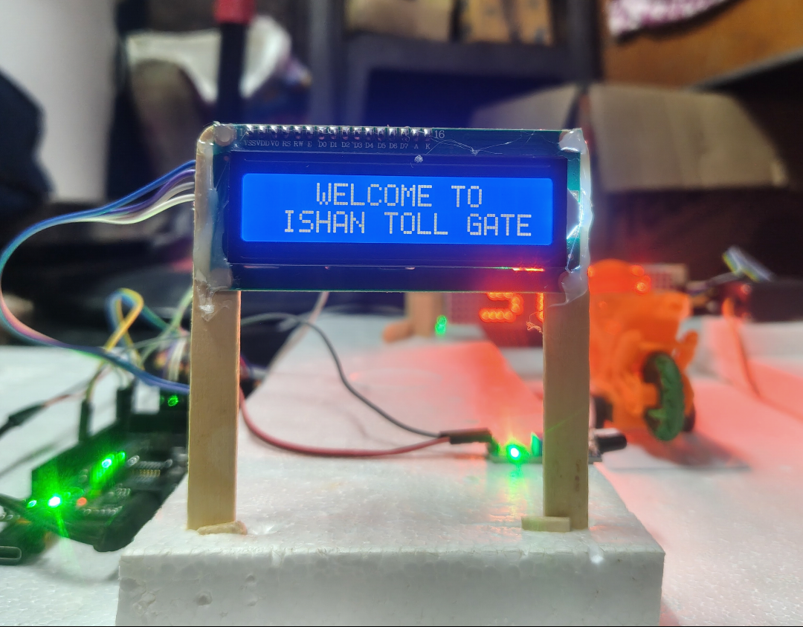
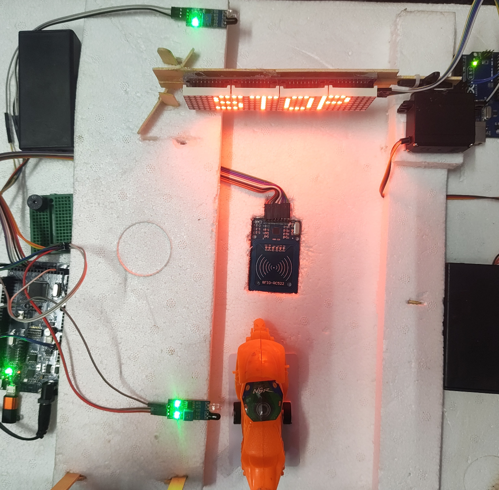
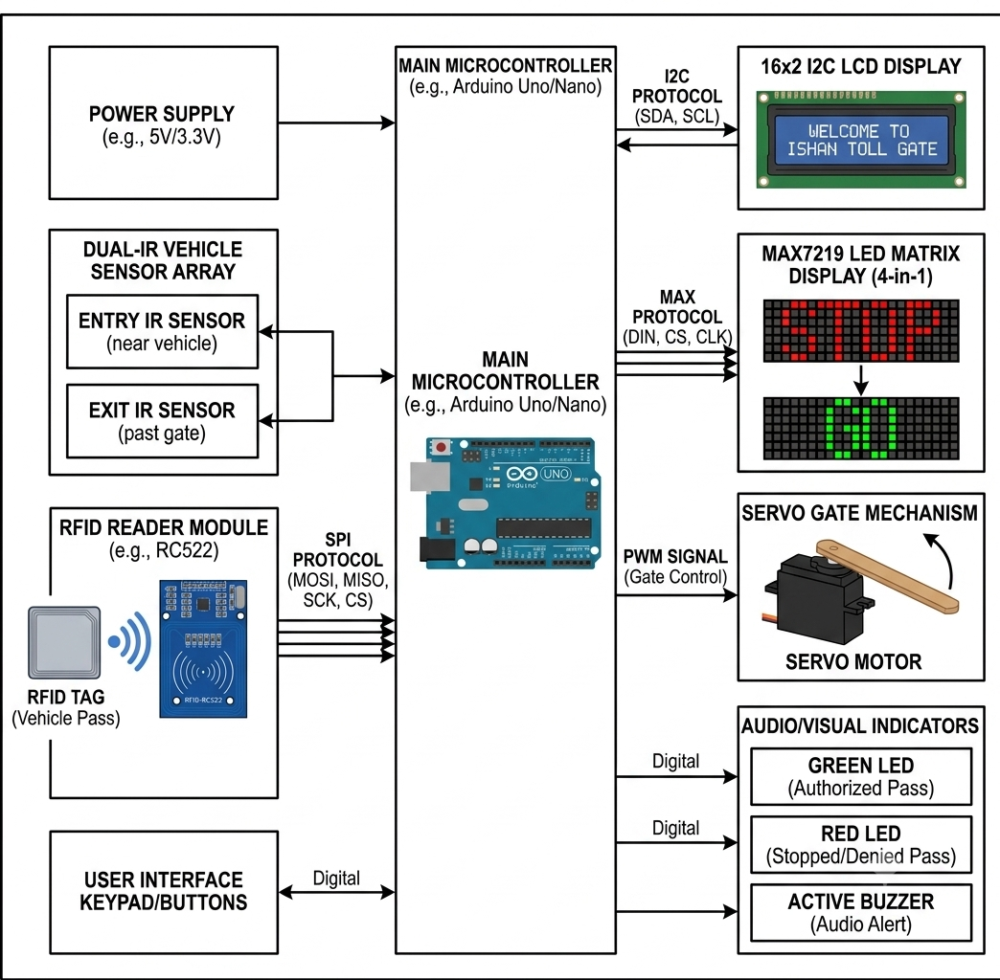

# GateWay.IO — Automated RFID Toll Gate System 🛣️🤖

An intelligent, state-driven automated toll booth prototype built using the Arduino ecosystem. This project integrates RFID vehicle identification, a dual-IR sensor array for dynamic physical entry/exit handling, a 16x2 I2C LCD human-machine interface, and a MAX7219 LED Dot Matrix display for real-time traffic signaling.


---

## ⚙️ Key Features
- **Secure Authentication:** Utilizes the RC522 RFID module (SPI protocol) for reliable, non-contact vehicle verification.
- **Dynamic Queue Management:** Implements dual-IR sensors (Entry and Exit) to track vehicle positioning, keeping the barrier open *only* while a vehicle is physically passing.
- **Real-Time Traffic Signaling:** Features a MAX7219 4-in-1 LED Dot Matrix display that dynamically updates its display state (e.g., changing from a **"STOP"** indicator to a **"GO"** directional arrow).
- **I2C Reduced-Pin Display:** Displays contextual user alerts ("WELCOME TO ISHAN TOLL GATE", "ACCESS GRANTED", "Drive Forward") using a 16x2 LCD requiring just 2 data pins.
- **Audio-Visual Feedback:** Integrated active buzzers and distinct status LEDs for rapid debugging and real-world safety compliance.

---

## 🛠️ Components List
- **Microcontroller:** Arduino Uno R3
- **RFID Module:** MFRC522 (13.56 MHz)
- **Actuator:** SG90 / MG996R Servo Motor
- **Visual Displays:** - 16x2 Character LCD with I2C Backpack Module
  - MAX7219 LED Dot Matrix Module (4-in-1 Display Unit)
- **Sensors:** 2x Active-Low Infrared (IR) Obstacle Avoidance Sensors
- **Indicators:** High-brightness LEDs (Red/Green), 5V Active Buzzer
- **Structure:** Custom chassis layout with overhead gantry mounting

---

## 🔌 Circuit Topology & Pin Mapping

### 1. RFID MFRC522 Connection (SPI)
| MFRC522 Pin | Arduino Uno Pin | Description |
| :--- | :--- | :--- |
| **VCC** | 3.3V | Main Power (Strictly 3.3V) |
| **RST** | Pin 9 | System Reset |
| **GND** | GND | Common Ground |
| **MISO** | Pin 12 | Master In Slave Out |
| **MOSI** | Pin 11 | Master Out Slave In |
| **SCK** | Pin 13 | Serial Clock |
| **SDA (SS)**| Pin 10 | Slave Select |

### 2. MAX7219 LED Matrix Connection
| MAX7219 Pin | Arduino Uno Pin | Description |
| :--- | :--- | :--- |
| **VCC** | 5V | Main Power |
| **GND** | GND | Common Ground |
| **DIN** | Pin A0 | Data Input |
| **CS** | Pin A1 | Chip Select |
| **CLK** | Pin A2 | Serial Clock |

### 3. Peripherals & Sensor Arrays
- **I2C LCD Display:** `SDA` ➔ Pin A4 | `SCL` ➔ Pin A5
- **IR Sensors:** `Entry Sensor (Front)` ➔ Pin 2 | `Exit Sensor (Back)` ➔ Pin 4
- **Servo Motor:** `Signal Pin` ➔ Pin 3 (PWM)
- **Alerts:** `Green LED` ➔ Pin 5 | `Red LED` ➔ Pin 6 | `Buzzer` ➔ Pin 7

---

## 💻 Logic Flow & State Machine

The firmware operates on a robust sequential state machine to handle traffic flow securely:

1. **STANDBY State:** The Red LED is active, the LCD flashes the scan prompt, and the MAX7219 display prints **"STOP"**.
2. **VERIFICATION State:** An RFID card is swiped. The Arduino compares the scanned Hex UID bytes with its internal database.
   - *Access Denied* ➔ Trigger warning frequency on Buzzer, flash Red LED, print error on LCD, and remain in standby.
   - *Access Granted* ➔ Toggle Green LED, chime buzzer twice, update LCD to "Drive Forward", and unlock the Entry phase.
3. **ENTRY TRIP State:** The vehicle drives forward and triggers the **Front IR Sensor**. The Servo gate swings up to $90^\circ$ and the MAX7219 updates immediately to **"GO"**.
4. **EXIT & CLEAR State:** The software programmatically locks the loop while the vehicle crosses the toll plaza line. The gate remains safely up as long as the vehicle is blocking the **Back IR Sensor**.
5. **RESET State:** Once the vehicle completely clears the exit line, the servo returns to $0^\circ$, the matrix reverts back to **"STOP"**, and flags reset for the next vehicle.

---

## 🚀 Getting Started

### Prerequisites
Ensure the following libraries are installed in your Arduino IDE:
- `MFRC522` by Miguel Balboa
- `LiquidCrystal_I2C` by Frank de Brabander
- `LedControl` by Wayoda
- `Servo` (Built-in)

### Installation & Flashing
1. Clone this repository to your local directory:
   ```bash
   git clone [https://github.com/YOUR_USERNAME/GateWay.IO.git](https://github.com/YOUR_USERNAME/GateWay.IO.git)
### Images 


### Block Diagram 

